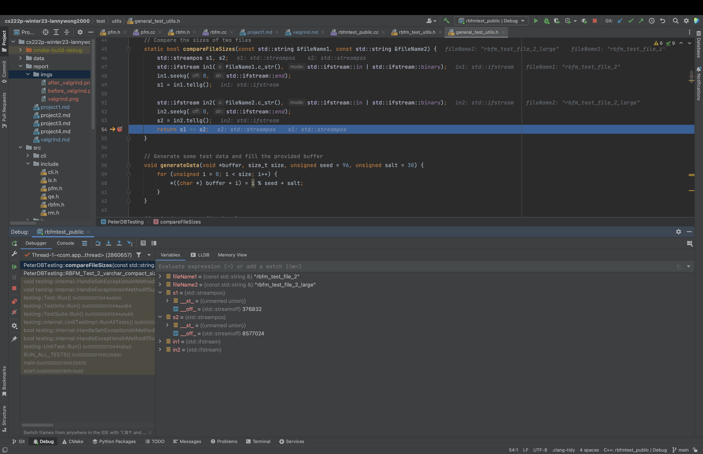
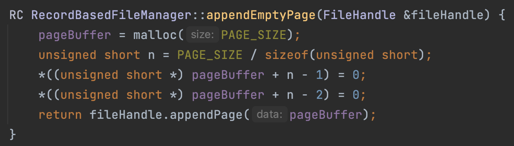
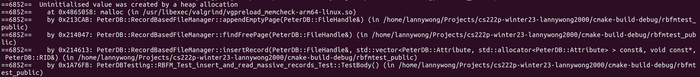
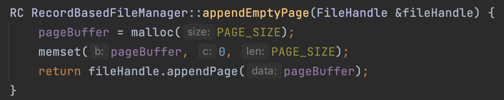

## Debugger and Valgrind Report

### 1. Basic information
- Github Repo Link: https://github.com/UCI-Chenli-teaching/cs222p-winter23-lannywong2000/blob/main/src/include/rbfm.h
- Student UCI NetID: 38242300
- Student Name: Lanny Wang

### 2. Using a Debugger
- I use CLion debugger to debug my code in my local environment. 
- The most common procedures of debugging are setting a breakpoint then comparing the attributes values with expected ones.

- One can also do Step Over after the break point to execute the program "line by line".
- Step Into and Step Out are also used to locate the root caller and the source of bug.

### 3. Using Valgrind

- I used Valgrind on Ubuntu 22.04 virtual machine to detect memory leak in heap. 
- For example, when appending an empty page to the end of file, at first I only allocated the memory block for page without initialising it. Then after writing the uninitialized memory block to disk, a lot of unexpected behaviors in my code happened.
- Via Valgrind, I was able to spot the issue and correct the code.

